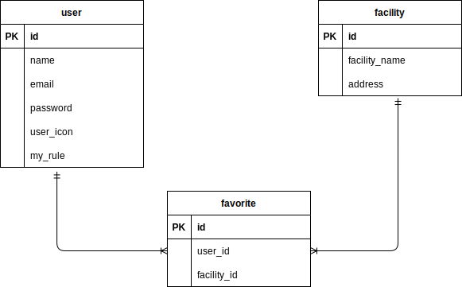

# サウナ施設検索アプリ

Google APIを利用した、サウナ施設を検索することができるウェブアプリケーションです。
お気に入りの施設を保存したり、施設をレビュー、施設情報を編集することができます。

## 作品
サイトURL  
https://sauna-app-9262760f4979.herokuapp.com/

## 目次
- [概要](#概要)
- [機能](#機能)
- [使用技術](#使用技術)
- [環境](#環境)
- [ER図](#er図)
- [作成した背景](#作成した背景)
- [今後の課題](#今後の課題)
- [ライセンス](#ライセンス)

## 概要
このアプリケーションは、Railsを使用して開発されたサウナ施設検索アプリです。Google APIを利用してサウナ施設の情報を検索し、ユーザーはお気に入りの施設を保存することができます。

## 機能一覧
* トップページ  
・キーワードもしくは都道府県からサウナ施設を検索できます。  
・下にスクロールするとログインユーザーのレビューを見ることができます。

* ユーザー認証機能（ログイン・ログアウト）  
・deviseを利用したログイン機能です。

* リストページ  
・検索したサウナ施設をgoogleマップとリストに表示しています。

* 詳細ページ  
・施設のお気に入り登録・削除ができます。  
・行ってみたい施設の登録・削除ができます。  
・施設の営業時間や設備情報などを編集し、登録できます。

* 施設のレビューの投稿  
・施設のレビューを投稿することができます。  

* 投稿にいいねができる  
・トップページに表示されているレビューのハートマークを押下するといいねができます。

## 使用技術
* Ruby on Rails
* Google API
* MySQL 
* CircleCI

## 環境
* Ruby 3.0.6
* Rails 6.1.7
* MySQL 8.3.0
* Puma 5.0
* Webpacker 5.4.4
* Turbolinks 5
* Bootsnap 1.4.4

## ER図

  

## 作成した背景
学生時代から地元のスーパー銭湯に通っており、その施設のサウナにもよく入っていました。  
ただ、上京してからどこのサウナに行くか迷うことがあったので、施設検索と情報を共有できるものを  
作ってみようと思い、作成しました。

## 今後の課題  
・施設の詳細情報を元に、検索機能に施設の特徴からも検索できるようにすること。  
・画像の保存をAWS S3に保存場所を移すこと。

## ライセンス

このプロジェクトは MIT ライセンスのもとで公開されています。
